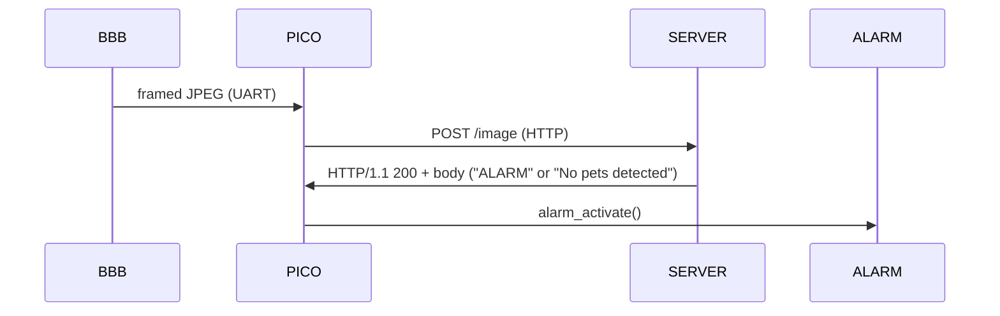

# Pet-Watcher

Lightweight pet-detection WIP project.  
Current flow: BeagleBone Black (OpenCV) watches an ROI, takes JPEG snapshots on motion and sends *framed* JPEGs over UART to a Raspberry Pi Pico 2W. The Pico forwards the image to a server by **HTTP POST**; the server returns an `"ALARM"` response body that the Pico can use to trigger a local alarm in case if a pet was detected.

---

# Architecture

# Components (short)

- **BBB (BeagleBone Black)**  
  Responsible for camera capture, ROI/motion detection, JPEG encoding and **sending framed packets** over a UART link to Pico.

- **Pico 2W**  
  - `frame_receiver` — UART ISR + ring buffer + frame state machine (receives framed JPEG from BBB).  
  - `snapshot_forwarder` — HTTP client using lwIP via `cyw43_arch_*` that `POST /image` to the PC/server.  
  - reacts to server response body containing `"ALARM"`.

- **Server**  
  Simple HTTP server (Python) that receives `POST /image` with `Content-Type: image/jpeg`, runs YOLOv5, and replies with `200 OK` and `"ALARM"` if pet was found.

---

# Frame protocol

All multi-byte integers and CRC fields are **little-endian**.

- MAGIC: two start bytes to align frames.
- HEADER_CRC: CRC-16 (CCITT, poly 0x1021, initial 0xFFFF) calculated over first 6 bytes (magic + 4-byte size).
- FRAME_CRC: CRC-16 (same algorithm) calculated over the `DATA` bytes only.
- DATA_SIZE = number of bytes of `DATA`.

---

# How it works

1. BBB detects motion in ROI and encodes a JPEG.
2. BBB frames the JPEG using the protocol above and writes bytes over UART to the Pico.
3. Pico interrupt routine collects incoming bytes into a ring buffer; the frame state machine parses header, receives `DATA`, reads trailing `FRAME_CRC`, verifies header CRC and frame CRC.
4. Once a full frame is validated, Pico `snapshot_forwarder_send_to_server()` copies the image and opens a TCP connection to `PC_SERVER_IP:PC_SERVER_PORT`, sends an HTTP `POST /image` with `Content-Type: image/jpeg` and the JPEG as body.
5. Server runs YOLOv5; if it detects class 15 (cat) or 16 (dog) it returns `"ALARM"` in the response body; Pico checks the returned HTTP body for substring `"ALARM"` and calls `alarm_activate()`.

# Roadmap / TODO

* [ ] Implement BBB OpenCV sender.
* [x] Implement Pico 2W forwarder.
* [ ] Implement server YOLOv5 script.  
* [ ] Add wiring diagrams and pin mappings.  
* [ ] Add BBB Yocto layer.

