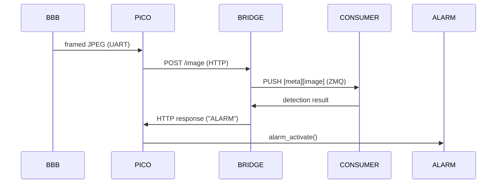

# Pet-Watcher

Lightweight pet-detection WIP project: BeagleBone Black (OpenCV) detects motion in user-defined ROI and sends JPEG snapshots over UART to a Raspberry Pi Pico 2W. The Pico forwards images to a PC bridge (HTTP → ZMQ). A server-side detector analyzes images and, if a pet is found, the server can ask the Pico to enable a local alarm.

---

# Architecture

---

# Components (short)

- **BBB**: capture, motion/ROI check, JPEG encode, send framed packet to Pico via UART.  
- **Pico 2W**: `frame_receiver` (UART), `snapshot_forwarder` (HTTP client), triggers `alarm_activate()` on alarm.  
- **Bridge**: HTTP server that forwards images to ZMQ.  
- **Consumer**: subscribes to ZMQ, runs an object detector, returns alarm decision.

---

# Frame protocol (summary)

- Start magic: 2 bytes  
- Header: 4-byte little-endian `data_size` + 2-byte header CRC (CRC-16) 
- Data: `data_size` bytes (JPEG)  
- Frame CRC: 2 bytes (CRC-16)

Match CRC and endianness exactly on sender and receiver.

---

# Roadmap / TODO

* [ ] BBB OpenCV sender implementation and example script
* [ ] Flow-control / retransmission for UART
* [ ] Implement command channel for consumer→bridge to request `ALARM` dynamically
* [ ] Add YOLOv5 integration example
* [ ] Documentation: wiring diagrams for sensors, alarm circuits
