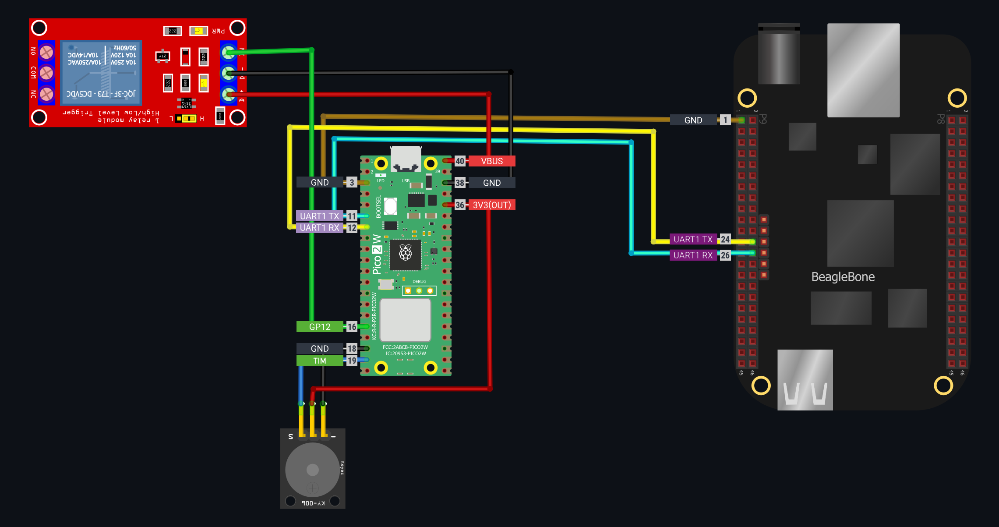

# PetWatch - Automated Pet Detection & Deterrent System

Ever had a cat that thinks your desk is their personal playground? Yeah, me too. My cat has this wonderful habit of jumping onto my workspace whenever I step away, hitting keyboard keys, knocking things over and generally causing chaos. Traditional solutions like motion sensors trigger on everything, and manual supervision isn't exactly practical when you're not around.

So I built PetWatch - a smart detection system that can actually tell the difference between a cat and, say, you walking by. When it spots a furry intruder, it can trigger deterrents like alarms or water sprayers or whatever is working for you to keep them away from forbidden zones. It doesn't have to be a desk, you may want to protect your lawn from stray or even wild animals. 

## How It Works

The system uses a three-part architecture that's both modular and reliable:


### The Components

**BeagleBone Black** - The eyes of the operation
- Captures video from a USB camera
- Runs motion detection using OpenCV background subtraction
- Only sends images when motion is detected
- Encodes frames as JPEG and transmits them via UART using frame protocol

**Raspberry Pi Pico 2W** - The forwarder
- Receives framed JPEG data from the BBB over UART
- Forwards snapshots to the detection server via HTTP POST
- Handles WiFi connectivity and automatic reconnection
- Triggers local deterrents based on server response

**Detection Server** - The analyzer
- Runs YOLOv5 model to identify cats, dogs, and other pets
- Returns "ALARM" response when pets are detected
- Sends email notifications with annotated detection snapshot
- Lightweight HTTP server that can run on any PC

## Current Status

**Steps:**
- [x] BeagleBone Black motion detection and UART transmission
- [x] Raspberry Pi Pico 2W WiFi forwarding and alarm triggering  
- [x] YOLOv5-based detection server with email notifications
- [x] Framed UART protocol
- [ ] Yocto Linux image for BeagleBone Black
- [x] Hardware integration (servo for water sprayer, buzzer)
- [x] Fine-tuning detection sensitivity
- [x] Wiring diagrams
- [ ] Installation scripts and setup automation

## Technical Deep Dive



### UART Frame Protocol

To reliably transfer JPEG images between the BBB and Pico we have to use framing protocol with CRC. All multi-byte values use little-endian encoding:

```
[MAGIC:2 bytes][SIZE:4 bytes][HEADER_CRC:2 bytes][DATA:N bytes][FRAME_CRC:2 bytes]
```

- **MAGIC**: `0xAA 0x55` - Start-of-frame marker for synch
- **SIZE**: image size in bytes
- **HEADER_CRC**: CRC-16 over the first 6 bytes (magic + size)
- **DATA**: The actual JPEG image data
- **FRAME_CRC**: CRC-16 over the image data for integrity checking

The Pico uses UART with a ring buffer (interrupt-driven) to handle incoming data, then a state machine parses frames and validates both header and data CRCs.

### Why This Architecture?

You might wonder why not just run everything on a single board i.e. RPI 4 or RPI 5. Well, RPI uses Broadcom's SOC. Broadcom doesn't share most of the SOC details unlike TI. Also TI has complete SDKs for their SOCs. But that's not the only reason. Here is my reasoning:

1. **Separation of Concerns**: *BBB handles computationally intensive motion detection, Pico handles networking, server handles AI.* 
<b>  
BBB's capabilities are not enough to run edge model, but even if it was enough - large models work much better and it's practically better to analyze data on faster powerful machines in case it's possible. I used RPI Pico as a forwarder only because I already had it and it's relatively easy to use it as a forwarder thanks to RPI Pico SDK. 

2. **Reliability**: *If WiFi dies, the BBB keeps detecting. If the server goes down, the Pico can still receive frames*
3. **Modularity**: *Easy to swap components - different cameras, different MCUs, different detection algorithms*
4. **Real-time Performance**: *Motion detection runs independently of network latency*

## Building the Yocto Image

The BeagleBone Black runs a custom Yocto Linux image with everything needed for pet detection. The `meta-petwatch` layer includes:

### Key Recipes

- **petwatch-image.bb**: Main system image with OpenCV, Python, and camera support
- **petwatch.bb**: The motion detection application as a systemd service  
- **config-pin.bb**: BeagleBone Black pin configuration utility

### UART Configuration

The BBB needs UART1 enabled for Pico communication. The kernel patch `0001-enable-UART1.patch` adds device tree entries:

```bash
# To generate a patch:
cd /path/to/sources/tmp/work-shared/beaglebone/kernel-source

# Edit arch/arm/boot/dts/am335x-boneblack.dts to add:
&uart1 {
    status = "okay";
    pinctrl-names = "default"; 
    pinctrl-0 = <&uart1_pins>;
};

&am33xx_pinmux {
    uart1_pins: uart1_pins {
        pinctrl-single,pins = <
            0x184 0x20  /* uart1_rxd, mode0 | PULLUP */
            0x180 0x00  /* uart1_txd, mode0 */
        >;
    };
};

# Generate patch
git add arch/arm/boot/dts/am335x-boneblack.dts
git commit -m "enable UART1"  
git format-patch -1 HEAD
```

### Building

```bash
# Clone Yocto (kirkstone branch)
git clone -b kirkstone git://git.yoctoproject.org/poky
git clone -b kirkstone git://git.openembedded.org/meta-openembedded
git clone -b kirkstone git://git.yoctoproject.org/meta-arm
git clone -b kirkstone git://git.yoctoproject.org/meta-ti

# Add meta-petwatch layer (copy from this repo)
cp -r /path/to/this/repo/meta-petwatch .

# Setup build environment  
source <sourcedir>/poky/oe-init-build-env build
bitbake-layers add-layer /path/to/this/repo/meta-petwatch
echo 'MACHINE ?= "beaglebone"' >> conf/local.conf
# comment out machines other than "beaglebone"
echo 'DISTRO_FEATURES:append = " systemd"' >> conf/local.conf
echo 'VIRTUAL-RUNTIME_init_manager = " systemd"' >> conf/local.conf
echo 'VIRTUAL-RUNTIME_initscripts = " systemd-compat-units"' >> conf/local.conf

# Build image
bitbake petwatch-image
```

## Hardware Setup

### BeagleBone Black Connections
- **USB Camera**: Any UVC-compatible camera on BBB's USB port
- **UART1**: P9.24 (TX) and P9.26 (RX) to Pico UART pins
- **Power**: Standard 5V/2A barrel jack

### Raspberry Pi Pico 2W Connections  
- **UART1**: GP4 (TX) and GP5 (RX) to BBB UART pins
- **Servo**: GP12 for servo (atomizer in my case)
- **Buzzer**: GP14 for audio alerts
- **Power**: USB or 3.3V supply

### Detection Server
- Any PC/laptop/remote machine with Python 3.8+ and decent CPU/GPU
- Needs to be on the same network as the Pico (or adjust the code accordingly)
- Install requirements: `pip install -r requirements.txt`

## Configuration

### Network Settings
Edit `BBB_pico_forwarder/include/config.h`:
```c
#define WIFI_SSID               "SomeSSID"
#define WIFI_PASSWORD           "SomePassword" 
#define PC_SERVER_IP            "192.168.1.1XX"
#define PC_SERVER_PORT          7702
```

### Detection Sensitivity
Adjust motion thresholds in `watch.py`:
```python
motion_threshold = 300   # Lower to make MORE sensitive
jpeg_quality = 70        # Higher is BETTER quality, LARGER files
```

### Email Notifications
Update server credentials in `server/server.py`:
```python
self.notification_emails = ["your-email@domain.com"]
self.email_user = "your-gmail@gmail.com"  
self.email_password = "your-app-password"  # Use Gmail app password (not account password! You may generate one in account settings)
```

## Running the System

1. **Start the detection server (you may explicitly create a service to automate this step):**
   ```bash
   python3 scripts/server.py
   ```

2. **Flash Pico firmware:**
   ```bash
   cd BBB_pico_forwarder
   # Build with Pico SDK and flash to device
   ```

3. **Boot BeagleBone with custom image:**
   - Flash SD card with built Yocto image `.wic` (dd or bb-imager)
   - System starts automatically via systemd

## Troubleshooting

**No camera detected:**
```bash
# On BBB, check for camera
lsusb
ls -la /dev/video*

# Test capture
v4l2-ctl --list-devices
```

**UART communication issues:**
```bash  
# Check UART devices
ls -la /dev/ttyS*

# Test UART manually
stty -F /dev/ttyS1 460800
echo "test" > /dev/ttyS1
```

**WiFi connection problems:**
- Check SSID/password in config.h
- Verify server IP is reachable: `ping 192.168.1.1XX`
- Monitor Pico debug output via USB serial

The modular architecture makes it easy to swap components and experiment with different approaches. Whether you're dealing with desk-invading cats or want to monitor pets in general, the system provides a solid foundation to build upon.


